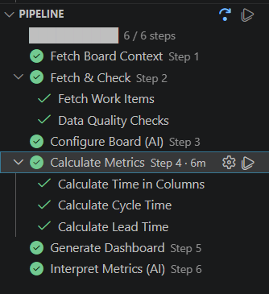
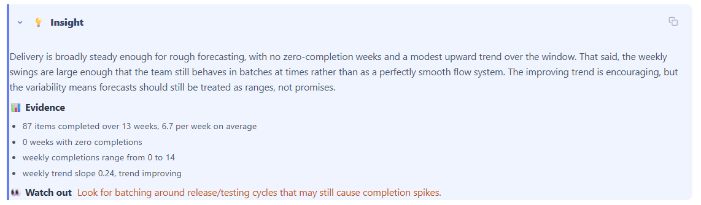
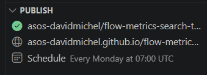

# AI Flow Metrics

A VS Code extension that connects to your Azure DevOps board, calculates flow metrics, and generates an interactive Chart.js dashboard — with GitHub Copilot handling the two AI steps automatically.


---

## What it produces

- **Cycle time** — histogram, P85, trend, and breakdown by work item type
- **Lead time** — same shape as cycle time, covering the full intake-to-done journey
- **Throughput** — weekly completions with trend line
- **Time in columns** — where work spends time and where the bottleneck is
- **Flow efficiency** — ratio of active time to total cycle time
- **WIP** — current in-progress items by column, with limit violations
- **Blockers** — impeded items by signal type, days lost, and timeline
- **Cumulative Flow Diagram** — with toggleable columns and arrival/departure rate lines
- **Aging WIP and scatter** — item age by column and scatter plot
- **Bug flow** — separate bug creation vs completion view

---

## Requirements

- **VS Code** with the AI Flow Metrics extension installed (`.vsix`)
- **Python 3.10+** on your PATH
- **Azure DevOps Personal Access Token** — read-only access to your board. Set as `ADO_PAT` in your environment, or the extension will prompt you securely on first use.
- **GitHub Copilot** — required for the two AI steps and the `@flowmetrics` chat participant

---

## Getting started

1. Install the `.vsix` from the [releases page](../../releases) via **Extensions → Install from VSIX**
2. Open the **AI Flow Metrics** Activity Bar panel
3. Click **+** (Add Board) and paste your Azure DevOps board URL
4. Click **▶ Autoplay** — the extension runs the full pipeline and opens the dashboard

---

## Autoplay pipeline

Autoplay runs all six steps in sequence, skipping any that are already complete:

| Step | What it does |
|------|-------------|
| **1 · Fetch Board Context** | Fetches board structure and column definitions from ADO |
| **2 · Fetch & Check** | Fetches all work item history and runs data quality checks |
| **3 · Configure Board (AI)** | Copilot analyses the board and writes `config.json` — opens it for your review before continuing |
| **4 · Calculate Metrics** | Calculates time-in-columns, cycle time, and lead time for the selected window |
| **5 · Generate Dashboard** | Renders the Chart.js dashboard and opens it in the preview panel |
| **6 · Interpret Metrics (AI)** | Copilot writes chart-by-chart insights, then re-generates the dashboard with them embedded |

Each step shows a green tick when done. Individual steps can also be run or re-run on their own.



---

## AI: Configure Board (Step 3)

Copilot analyses the board's column structure, historical column names, tag usage, and card rules to produce `config.json`. It decides:

- **Clock start/end** — which columns mark the start of lead time (intake) and cycle time (active work)
- **Historical column mapping** — old column names mapped to their current equivalents so history is consistent
- **Flow efficiency** — which columns are *active* (work is happening) vs *waiting* (queued)
- **Blocker signals** — tags or swimlanes that indicate an item is blocked, with a label and colour for the charts

```json
{
  "lead_time":  { "clock_start": { "type": "column", "value": "Upcoming" },   "clock_end": { "type": "column", "value": "Done" } },
  "cycle_time": { "clock_start": { "type": "column", "value": "Refinement" }, "clock_end": { "type": "column", "value": "Done" } },
  "flow_efficiency": {
    "active_columns":  ["Refinement", "In Development", "In Review", "In Testing"],
    "waiting_columns": ["Ready"]
  },
  "blocked_time": {
    "signals": [
      { "mechanism": "tag", "tags": ["Blocked"], "label": "Blocked", "color": "#f06673" }
    ]
  }
}
```

`config.json` persists between runs — if the board structure hasn't changed, Step 3 is skipped automatically.

---

## AI: Interpret Metrics (Step 6)

Copilot reads the calculated metrics and produces a full analysis embedded directly in the dashboard:

- **Per-chart insights** — each chart gets a collapsible insight box with a plain-English finding, supporting evidence, and a watch-out signal
- **Executive summary** — a leadership-facing narrative describing the team's delivery health and the main constraint
- **Diagnostic findings** — specific bottlenecks and systemic issues identified from the data
- **Outlier patterns** — unusual items or behaviours worth investigating
- **Investigation questions** — suggested follow-up questions for the team
- **Recommendations** — prioritised actions to improve flow



---

## @flowmetrics chat

Type `@flowmetrics` in GitHub Copilot Chat to ask questions about your board without re-running the pipeline:

- *"What is our P85 cycle time this quarter?"*
- *"Which items have been in progress the longest?"*
- *"Show me blockers from the last month."*
- *"Change the cycle time clock start to the Refinement column."*

The participant reads your cached output files and can fetch live work item data directly from ADO. It can also update `config.json` when you ask it to reclassify columns or change blocker signals.

---

## Publishing to GitHub

Connect a board to a GitHub repository to publish the dashboard as a GitHub Pages site and schedule automatic updates via GitHub Actions.

1. Open the **Publish** panel and click **Publish to GitHub**
2. Choose an existing repo or let the extension create one
3. Optionally configure a schedule — the workflow runs `fetch → check → calculate → interpret → publish` on cron

A sync indicator in the Boards panel shows whether your local files are up to date with the latest GitHub commit.



---

## Analysis window

The default window is the last 6 months. To change it, click the window label shown next to **Step 4** in the Pipeline panel and choose a preset or enter a custom date range:

| Option | Example |
|--------|---------|
| Rolling period | Last 4 weeks, 3 months, 6 months, 1 year |
| Custom range | Pick a start date (and optionally an end date) |

Re-run Step 4 after changing the window. The setting is remembered per board.

