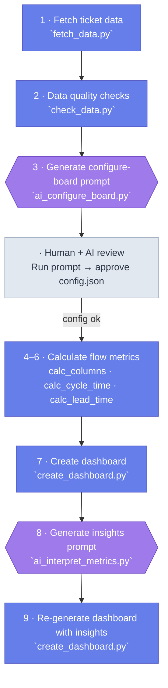

# AI Flow Metrics

A VS Code extension that connects to your Azure DevOps board, calculates flow metrics, and generates an interactive Chart.js dashboard — with GitHub Copilot handling the two AI steps automatically.


> *Flow tab showing CFD, Arrival/Departure ratio, Net Flow, and Time in Columns*

---

## What it produces

- **Cycle time** — histogram, P85, trend, and breakdown by work item type
- **Lead time** — same shape as cycle time, covering the full intake-to-done journey
- **Throughput** — weekly completions with trend line
- **Time in columns** — where work spends time and where the bottleneck is
- **Flow efficiency** — ratio of active time to total cycle time
- **WIP** — current in-progress items by column, with limit violations
- **Blockers** — impeded items by signal type, days lost, and timeline
- **Cumulative Flow Diagram** — with toggleable columns and arrival/departure rate lines
- **Aging WIP and scatter** — item age by column and scatter plot
- **Bug flow** — separate bug creation vs completion view

---

## Requirements

- **VS Code** with the AI Flow Metrics extension installed (`.vsix`)
- **Python 3.10+** on your PATH
- **Azure DevOps Personal Access Token** — read-only access to your board. Set as `ADO_PAT` in your environment, or the extension will prompt you securely on first use.
- **GitHub Copilot** — required for the two AI steps and the `@flowmetrics` chat participant

---

## Getting started

1. Install the `.vsix` from the [releases page](../../releases) via **Extensions → Install from VSIX**
2. Open the **AI Flow Metrics** Activity Bar panel
3. Click **+** (Add Board) and paste your Azure DevOps board URL
4. Click **▶ Autoplay** — the extension runs the full pipeline and opens the dashboard

---

## Autoplay pipeline

Autoplay runs all six steps in sequence, skipping any that are already complete:

| Step | What it does |
|------|-------------|
| **1 · Fetch Board Context** | Fetches board structure and column definitions from ADO |
| **2 · Fetch & Check** | Fetches all work item history and runs data quality checks |
| **3 · Configure Board (AI)** | Copilot analyses the board and writes `config.json` — opens it for your review before continuing |
| **4 · Calculate Metrics** | Calculates time-in-columns, cycle time, and lead time for the selected window |
| **5 · Generate Dashboard** | Renders the Chart.js dashboard and opens it in the preview panel |
| **6 · Interpret Metrics (AI)** | Copilot writes chart-by-chart insights, then re-generates the dashboard with them embedded |

Each step shows a green tick when done. Individual steps can also be run or re-run on their own.

---

## AI: Configure Board (Step 3)

Copilot analyses the board's column structure, historical column names, tag usage, and card rules to produce `config.json`. It decides:

- **Clock start/end** — which columns mark the start of lead time (intake) and cycle time (active work)
- **Historical column mapping** — old column names mapped to their current equivalents so history is consistent
- **Flow efficiency** — which columns are *active* (work is happening) vs *waiting* (queued)
- **Blocker signals** — tags or swimlanes that indicate an item is blocked, with a label and colour for the charts

```json
{
  "lead_time":  { "clock_start": { "type": "column", "value": "Upcoming" },   "clock_end": { "type": "column", "value": "Done" } },
  "cycle_time": { "clock_start": { "type": "column", "value": "Refinement" }, "clock_end": { "type": "column", "value": "Done" } },
  "flow_efficiency": {
    "active_columns":  ["Refinement", "In Development", "In Review", "In Testing"],
    "waiting_columns": ["Ready"]
  },
  "blocked_time": {
    "signals": [
      { "mechanism": "tag", "tags": ["Blocked"], "label": "Blocked", "color": "#f06673" }
    ]
  }
}
```

`config.json` persists between runs — if the board structure hasn't changed, Step 3 is skipped automatically.

---

## AI: Interpret Metrics (Step 6)

Copilot reads the calculated metrics and writes chart-by-chart insights including evidence, watch-outs, and a leadership narrative. These are embedded directly into the dashboard.


> *Each chart has a collapsible insight box with evidence and a watch-out signal*


> *Overview tab: AI-generated diagnostic findings, outlier patterns, investigation questions, and recommendations*

---

## @flowmetrics chat

Type `@flowmetrics` in GitHub Copilot Chat to ask questions about your board without re-running the pipeline:

- *"What is our P85 cycle time this quarter?"*
- *"Which items have been in progress the longest?"*
- *"Show me blockers from the last month."*
- *"Change the cycle time clock start to the Refinement column."*

The participant reads your cached output files and can fetch live work item data directly from ADO. It can also update `config.json` when you ask it to reclassify columns or change blocker signals.

---

## Publishing to GitHub

Connect a board to a GitHub repository to publish the dashboard as a GitHub Pages site and schedule automatic updates via GitHub Actions.

1. Open the **Publish** panel and click **Publish to GitHub**
2. Choose an existing repo or let the extension create one
3. Optionally configure a schedule — the workflow runs `fetch → check → calculate → interpret → publish` on cron

A sync indicator in the Boards panel shows whether your local files are up to date with the latest GitHub commit.

---

## Analysis window

The default window is the last 6 months. Click the window label next to Step 4 to change it — rolling periods (4w / 3m / 6m / 1y) or a custom date range. Re-run Step 4 to apply the new window.


> *Flow tab showing CFD, Arrival/Departure ratio, Net Flow, and Time in Columns*

## What it produces

- **Cycle time** — histogram, P85, trend, and breakdown by work item type
- **Lead time** — same shape as cycle time, covering the full intake-to-done journey
- **Throughput** — weekly completions with trend line
- **Time in columns** — where work spends time and where the bottleneck is
- **Flow efficiency** — ratio of active time to total cycle time
- **Work start efficiency** — how long items wait before development begins
- **WIP** — current in-progress items by column, with limit violations
- **Blockers** — impeded items by signal type, days lost, timeline, and by-column breakdown
- **Cumulative Flow Diagram** — with toggleable columns and dynamic arrival/departure rate lines
- **Net flow** — items finished minus items started each week
- **Arrival/Departure ratio** — per column, to identify accumulation points
- **Aging WIP and scatter** — item age by column and scatter plot
- **Bug flow** — separate bug creation vs completion view

---

## Prerequisites

- Python 3.10+
- An Azure DevOps **[Personal Access Token](https://learn.microsoft.com/en-us/azure/devops/organizations/accounts/use-personal-access-tokens-to-authenticate?view=azure-devops&tabs=Windows)** with read access to the board
- Set the environment variable: `ADO_PAT=<your-token>`

---

## Pipeline steps

`aiflowmetrics.py` runs the pipeline in two separate commands. You can also run each step individually.



| Step | Script | What it does |
|------|--------|--------------|
| 1 | `src/fetch_data.py` | Fetches board context, work items, and full column + tag history from ADO |
| 2 | `src/check_data.py` | Runs data quality checks; writes `data_quality_report.json`, `excluded_items.json`, `work_item_rework.json` |
| 3 | `src/ai_configure_board.py` | Generates an AI prompt to configure the board |
| — | *(human + AI)* | Run the AI prompt; save the JSON response as `config.json` |
| 4 | `src/calc_columns.py` | Calculates time-in-columns → `output/metrics/time_in_columns.json` |
| 5 | `src/calc_cycle_time.py` | Calculates cycle time and throughput → `output/metrics/cycle_time.json` |
| 6 | `src/calc_lead_time.py` | Calculates lead time → `output/metrics/lead_time.json` |
| 7 | `src/create_dashboard.py` | Renders everything into `output/dashboard.html` |
| 8 *(optional)* | `src/ai_interpret_metrics.py` | Generates AI chart insights → `output/data/insights.json` |
| 9 *(optional)* | `src/create_dashboard.py` | Re-renders dashboard with insights embedded into each chart |

Steps 4–6 require `output/data/config.json` to exist.

### `configure` command

```
python aiflowmetrics.py configure <board-url> [options]
```

| Option | Default | Description |
|--------|---------|-------------|
| `--short-dwell-minutes N` | `60` | Flag column visits shorter than N minutes as suspicious in the data quality report. |
| `--yes` | off | Skip confirmation prompts. |
| `--clean` | off | Delete all generated output files before running. |

### `metrics` command

```
python aiflowmetrics.py metrics <config-file> [options]
```

| Option | Default | Description |
|--------|---------|-------------|
| `--window` | `6m` | Analysis window: `2w`, `1m`, `3m`, `6m`, `1y`. |
| `--from YYYY-MM-DD` | — | Explicit window start date (overrides `--window`). |
| `--to YYYY-MM-DD` | today | Explicit window end date (used with `--from`). |
| `--ai-mode` | `prompt` | `prompt` (default) or `skip`. `skip` omits step 8 (insights). |
| `--yes` | off | Skip confirmation prompts. |
| `--clean` | off | Delete metrics and dashboard output files before running (keeps config). |

**Examples:**

```powershell
# Configure — fetch data and generate board config prompt
python aiflowmetrics.py configure https://dev.azure.com/org/project/_boards/...
```

```powershell
# Metrics — last 6 months
python aiflowmetrics.py metrics output/data/config.json --window 6m
```

```powershell
# Metrics — clean slate before running
python aiflowmetrics.py metrics output/data/config.json --window 6m --clean
```

```powershell
# Metrics — specific date range
python aiflowmetrics.py metrics output/data/config.json --from 2025-01-01 --to 2025-06-30
```

---

## AI interpretation

Two scripts generate `.prompt.md` files that open automatically in VS Code Copilot (or can be pasted into any AI assistant). The AI reads the file and writes the output JSON directly.

### Board configuration

Analyses the board's column structure, historical column names, tag usage, and card rules to propose a `config.json`. The AI makes four types of decision:

- **Clock start/end** — which columns mark the start of lead time (intake) and cycle time (active work), and where the clock stops (e.g. Done)
- **Historical column mapping** — old column names that no longer exist on the board are mapped to their current equivalents so history is consistent
- **Flow efficiency** — which columns count as *active* (work is happening) vs *waiting* (work is queued), used to calculate the ratio of value-add time
- **Blocker signals** — tags or swimlanes that indicate an item is blocked or on hold, with a label and colour for the charts

Example output:

```json
{
  "lead_time":  { "clock_start": { "type": "column", "value": "Upcoming" },    "clock_end": { "type": "column", "value": "Done" } },
  "cycle_time": { "clock_start": { "type": "column", "value": "Refinement" },  "clock_end": { "type": "column", "value": "Done" } },
  "historical_column_mapping": {
    "In Progress": "In Development",
    "Ready for Dev": "Ready",
    "Closed": "Done"
  },
  "flow_efficiency": {
    "active_columns":  ["Refinement", "In Development", "In Review", "In Testing"],
    "waiting_columns": ["Ready"]
  },
  "blocked_time": {
    "signals": [
      { "mechanism": "tag", "tags": ["Blocked"],  "label": "Blocked",  "color": "#f06673" },
      { "mechanism": "tag", "tags": ["OnHold"],   "label": "On Hold",  "color": null }
    ]
  }
}
```

`config.json` persists between runs — if the board structure hasn't changed you can skip step 3 and reuse the existing file.

```powershell
python aiflowmetrics.py configure https://dev.azure.com/org/project/_boards/...
```

### Metrics interpretation

Generates chart-by-chart insights and a leadership narrative that are embedded in the dashboard.

```bash
python src/ai_interpret_metrics.py
python src/ai_interpret_metrics.py --dump-summary    # print the anonymised metrics JSON sent to the AI
```


> *Each chart has a collapsible insight box with evidence and a watch-out signal*


> *Overview tab: AI-generated diagnostic findings, outlier patterns, investigation questions, and recommendations*

---

## Output files

```
output/
  dashboard.html              Single-file dashboard (open in any browser)
  data/
    context.json              Board structure, columns, work item type styles
    work_items.json           Current state of all work items
    work_item_history.json    Full column + tag change history
    work_item_rework.json     Items that moved backwards through columns
    data_quality_report.json  Data quality check results
    excluded_items.json       Items excluded from metrics (missing history etc.)
    config.json               Your confirmed flow metric configuration
    insights.json             AI-generated chart insights (optional)
  metrics/
    cycle_time.json
    lead_time.json
    time_in_columns.json
```

---

