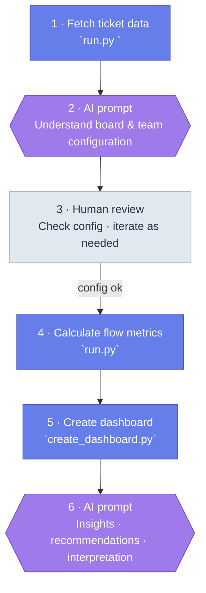

# AI Flow Metrics

A Python + Chart.js tool that fetches work item data from **Azure DevOps**, calculates flow metrics, and generates a self-contained HTML dashboard.


> *Flow tab showing CFD, Arrival/Departure ratio, Net Flow, and Time in Columns*

## What it produces

- **Cycle time** — histogram, P85, trend, and breakdown by work item type
- **Lead time** — same shape as cycle time, covering the full intake-to-done journey
- **Throughput** — weekly completions with trend line
- **Time in columns** — where work spends time and where the bottleneck is
- **Flow efficiency** — ratio of active time to total cycle time
- **Work start efficiency** — how long items wait before development begins
- **WIP** — current in-progress items by column, with limit violations
- **Blockers** — impeded items by signal type, days lost, timeline, and by-column breakdown
- **Cumulative Flow Diagram** — with toggleable columns and dynamic arrival/departure rate lines
- **Net flow** — items finished minus items started each week
- **Arrival/Departure ratio** — per column, to identify accumulation points
- **Aging WIP and scatter** — item age by column and scatter plot
- **Bug flow** — separate bug creation vs completion view

---

## Prerequisites

- Python 3.10+
- An Azure DevOps **Personal Access Token** with read access to the board
- Set the environment variable: `ADO_PAT=<your-token>`

---

## Quickstart

```bash
# First run — fetch data and generate the dashboard
python run.py https://dev.azure.com/your-org/your-project/_boards/board/t/your-team/...

# Subsequent runs (data already fetched, just regenerate the dashboard)
python src/create_dashboard.py
```

---

## Pipeline steps

`run.py` orchestrates the full pipeline. You can also run each step individually.



| Step | Script | What it does |
|------|--------|--------------|
| 1 | `src/fetch_data.py` | Fetches board context, work items, and full column + tag history from ADO |
| 2 | `src/check_data.py` | Runs data quality checks; writes `data_quality_report.json`, `excluded_items.json`, `work_item_rework.json` |
| 3 | `src/ai_configure_board.py` | Generates an AI prompt to configure the board |
| — | *(human + AI)* | Run the AI prompt; save the JSON response as `config.json` |
| 4 | `src/calc_columns.py` | Calculates time-in-columns → `output/metrics/time_in_columns.json` |
| 5 | `src/calc_cycle_time.py` | Calculates cycle time and throughput → `output/metrics/cycle_time.json` |
| 6 | `src/calc_lead_time.py` | Calculates lead time → `output/metrics/lead_time.json` |
| 7 | `src/create_dashboard.py` | Renders everything into `output/dashboard.html` |
| 8 *(optional)* | `src/ai_interpret_metrics.py` | Generates AI chart insights → `output/data/insights.json`; re-run step 7 to embed them |

Steps 4–6 require `output/data/config.json` to exist.

### `run.py` options

| Option | Default | Description |
|--------|---------|-------------|
| `--window 6m` | `6m` | Analysis window for metrics. Accepts `2w`, `1m`, `3m`, `6m`, `1y`. |
| `--from YYYY-MM-DD` | — | Explicit window start date (overrides `--window`). |
| `--to YYYY-MM-DD` | today | Explicit window end date (used with `--from`). |
| `--clean` | off | Delete all generated output files before running. |
| `--yes` | off | Skip all confirmation prompts (required for fully automated runs). |
| `--short-dwell-minutes N` | `60` | Flag column visits shorter than N minutes as suspicious in the data quality report. |
| `--ai-mode MODE` | `prompt` | AI mode for both board configuration and chart insights — see [AI modes](#ai-modes) below. `skip` omits the insights step only. |

**Example:**
```bash
python run.py https://dev.azure.com/org/project/_boards/... --window 3m --clean
```

---

## AI interpretation

Two scripts generate AI prompts. Both support a `--mode` flag.

### AI modes

| Mode | What happens |
|------|--------------|
| `prompt` *(default)* | Writes a `.prompt.md` file with the full prompt (including inline data). Opens it in VS Code Copilot automatically if `code` is on PATH — or paste the file contents into any AI assistant. |
| `auto` | Calls any OpenAI-compatible API directly and writes the output automatically. Configure via env vars — works with OpenAI, Claude (via compatible endpoint), GitHub Models, Azure OpenAI, etc. Requires `OPENAI_API_KEY`. |

**Environment variables for `auto` mode:**

| Variable | Default | Description |
|----------|---------|-------------|
| `OPENAI_API_KEY` | *(required)* | API key — OpenAI key, GitHub PAT, Azure key, etc. |
| `OPENAI_MODEL` | `gpt-4o` | Model name (e.g. `gpt-4o`, `claude-sonnet-4-5`). |
| `OPENAI_BASE_URL` | `https://api.openai.com/v1` | Base URL for any OpenAI-compatible endpoint. |

**Examples:**

```powershell
# ChatGPT (OpenAI)
$env:OPENAI_API_KEY = "sk-..."
$env:OPENAI_MODEL   = "gpt-4o"
python run.py <board-url> --ai-mode auto --yes
```

```powershell
# Claude via GitHub Models (free with a GitHub account)
$env:OPENAI_API_KEY  = "<your-github-pat>"
$env:OPENAI_BASE_URL = "https://models.inference.ai.azure.com"
$env:OPENAI_MODEL    = "claude-sonnet-4-5"
python run.py <board-url> --ai-mode auto --yes
```

```bash
# Claude via GitHub Models (macOS / Linux)
export OPENAI_API_KEY="<your-github-pat>"
export OPENAI_BASE_URL="https://models.inference.ai.azure.com"
export OPENAI_MODEL="claude-sonnet-4-5"
python run.py <board-url> --ai-mode auto --yes
```

**All compatible endpoints:**

| Provider | `OPENAI_BASE_URL` | Auth |
|----------|-------------------|------|
| OpenAI | `https://api.openai.com/v1` *(default)* | OpenAI API key |
| GitHub Models | `https://models.inference.ai.azure.com` | GitHub PAT |
| Azure OpenAI | `https://<resource>.openai.azure.com/openai/deployments/<deployment>` | Azure key |

### Board configuration

Proposes column classification, flow efficiency rules, and blocker tag signals. Run this before setting up `config.json`.

```bash
python src/ai_configure_board.py                     # prompt mode (default)
python src/ai_configure_board.py --mode auto        # calls API directly → writes config.json
```

### Metrics interpretation

Generates chart-by-chart insights and a leadership narrative that are embedded in the dashboard.

```bash
python src/ai_interpret_metrics.py                   # prompt mode (default)
python src/ai_interpret_metrics.py --mode auto       # calls API directly → writes insights.json
python src/ai_interpret_metrics.py --dump-summary    # print the anonymised metrics JSON sent to the AI
```

When using `run.py`, both steps share the single `--ai-mode` flag.


> *Each chart has a collapsible insight box with evidence and a watch-out signal*


> *Overview tab: AI-generated diagnostic findings, outlier patterns, investigation questions, and recommendations*

---

## Output files

```
output/
  dashboard.html              Single-file dashboard (open in any browser)
  data/
    context.json              Board structure, columns, work item type styles
    work_items.json           Current state of all work items
    work_item_history.json    Full column + tag change history
    config.json               Your confirmed flow metric configuration
    insights.json             AI-generated chart insights (optional)
  metrics/
    cycle_time.json
    time_in_columns.json
```

---

## Configuration (`config.json`)

Key fields:

```json
{
  "cycle_time": {
    "clock_start": { "type": "column", "value": "Ready for Dev" },
    "clock_end":   { "type": "column", "value": "Closed" }
  },
  "flow_efficiency": {
    "active_columns":  ["In Development", "In Review", "QA"],
    "waiting_columns": ["Ready for Dev", "External Review", "Ready for QA", "Ready for release"]
  },
  "blocked_time": {
    "signals": [
      { "mechanism": "tag", "tags": ["Blocked", "Blocked by BAG", "Blocked by PLP"], "label": "Blocked",           "color": "#f06673" },
      { "mechanism": "tag", "tags": ["Waiting - Internal"],                           "label": "Waiting Internal", "color": "#ffe0c1" }
    ]
  }
}
```

`config.json` is produced by running `ai_configure_board.py`. The AI detects blocked signals from card rules and actual tags in use, and can merge tag variants into a single signal (e.g. "Blocked by BAG" + "Blocked by PLP" → one "Blocked" entry). Each signal has a `label` (shown in charts) and a `color` (from the card rule background colour).
